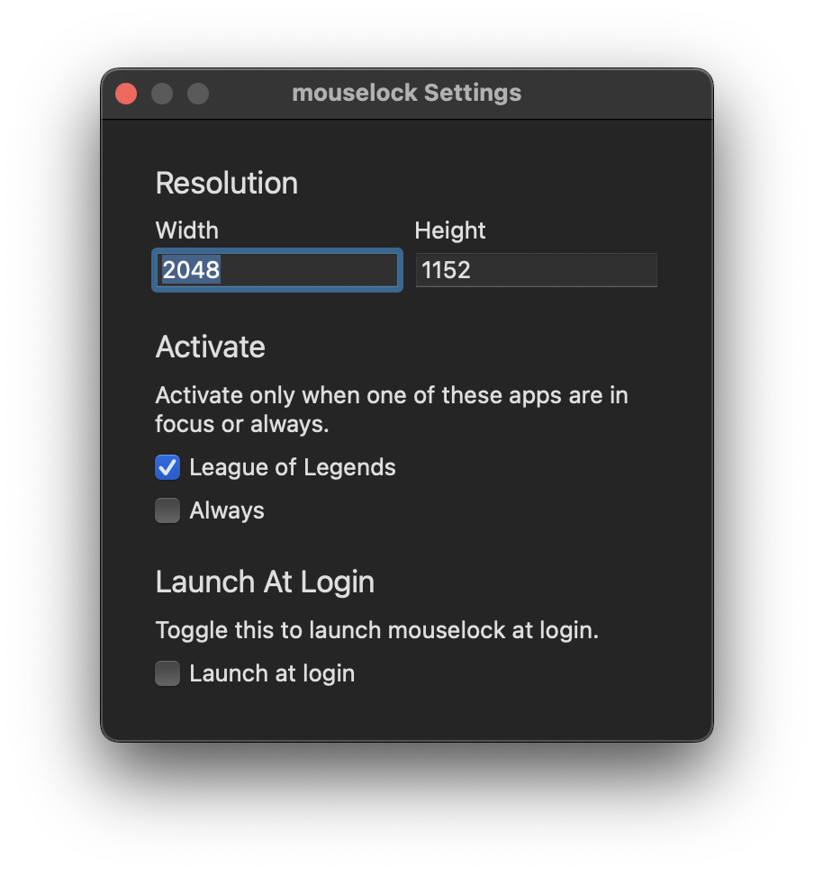

<h1 align="center">
  
   
  Mouselock
</h1>

  
   
  Lock mouse cursor to a centered area of the screen for MacOS.
   
  

## Why?

In League of Legends (and potentially other games), the cursor is not locked properly in borderless mode. This app tries to fix that.

## Notes

This app was originally created by [mxrlkn](https://github.com/mxrlkn/mouselock) but has not had a release since 2022.

My version of the app contains the following improvements:

- it is now a menubar-only app
- it can be launched at login
- added a settings window using the original view
- made a new LoL-style app icon
